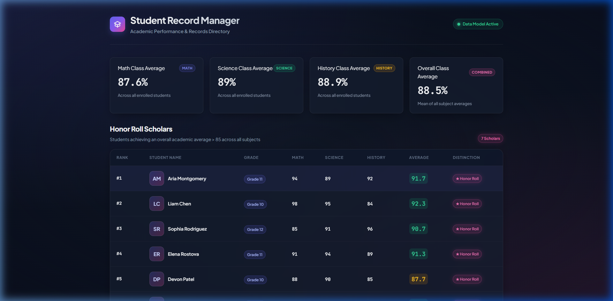
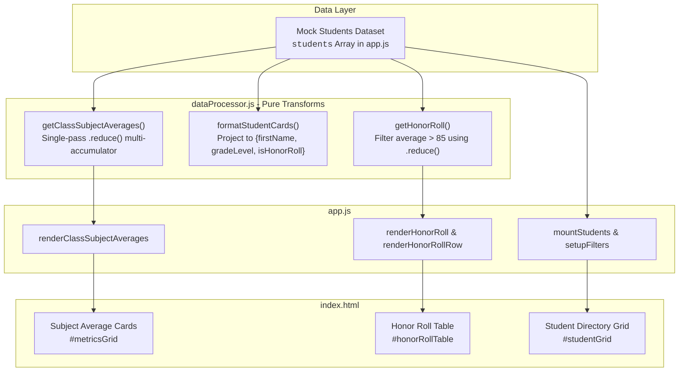

<div align="center">

# 🎓 Student Record Manager

An academic performance directory and record management dashboard built with modern **Vanilla JavaScript (ES6+)**, **HTML5**, and responsive **CSS3**. Engineered strictly following pure functional programming patterns—leveraging `.map()`, `.filter()`, `.reduce()`, and parameter/variable destructuring with zero loop constructs.

---

[](https://developer.mozilla.org/en-US/docs/Web/HTML)
[](https://developer.mozilla.org/en-US/docs/Web/CSS)
[](https://developer.mozilla.org/en-US/docs/Web/JavaScript)
[](https://nodejs.org/)
[](LICENSE)

</div>

---

## 🖥️ Desktop Preview



---

## 🏗️ System Architecture

The application adopts a modular, unidirectional functional architecture. Raw student models are processed through pure functional transformations into immutable data projections, which are subsequently mounted into semantic HTML structures.



---

## ⚡ Functional JavaScript Deep Dive

This project strictly adheres to **Declarative & Functional JavaScript Standards**:
1. **Never use `for`, `for...of`, or `forEach` loops**.
2. **Rely exclusively on `.map()`, `.filter()`, and `.reduce()`**.
3. **Always use array and object destructuring for variable assignments and function parameters**.
4. **Write pure, modular functions using ES6 arrow syntax**.

Below is the concrete breakdown of how each functional paradigm is implemented:

### 1. `.map()` — Transforming and Projecting Data

`.map()` is employed whenever transforming an array into a new shape or generating markup strings:

- **Record Projection ([`formatStudentCards`](dataProcessor.js))**:
  Transforms raw student objects into lightweight cards with only first name, grade, and honor roll status:
  ```javascript
  export const formatStudentCards = (studentList = []) => {
    const [students] = [Array.isArray(studentList) ? studentList : (studentList?.students ?? [])];

    return students.map(({ name, gradeLevel, scores }) => {
      const [firstName] = name.split(' ');
      const { math, science, history } = scores;
      const [scoresList] = [[math, science, history]];
      const [totalScore, subjectCount] = [
        scoresList.reduce((acc, curr) => acc + curr, 0),
        scoresList.length
      ];
      const [isHonorRoll] = [(totalScore / subjectCount) > 85];

      return { firstName, gradeLevel, isHonorRoll };
    });
  };
  ```

- **Semantic HTML Table Rows ([`renderHonorRoll`](app.js))**:
  Transforms the list of honor students into accessible `<tr>` elements:
  ```javascript
  const [rowsHtml] = [
    honorRollStudents
      .map((student, index) => renderHonorRollRow({ student, rank: index + 1 }))
      .join('')
  ];
  ```

- **Subject Badge Generation ([`renderSubjectBadges`](app.js))**:
  Transforms an array of subject strings into badge elements:
  ```javascript
  export const renderSubjectBadges = ({ subjects = [] }) =>
    subjects
      .map((subject) => `<span class="badge badge-subject">${escapeHtml({ text: subject })}</span>`)
      .join('');
  ```

- **Initials Computation**:
  Splits full names and extracts character initials using destructured parameters:
  ```javascript
  const [initials] = [
    name
      .split(' ')
      .map(([char]) => char)
      .join('')
  ];
  ```

---

### 2. `.filter()` — Selecting Elements Matching Predicates

`.filter()` evaluates boolean predicates without mutating source arrays:

- **Honor Roll Qualification ([`getHonorRoll`](dataProcessor.js))**:
  Extracts scholars whose overall average score across math, science, and history strictly exceeds `85`:
  ```javascript
  export const getHonorRoll = (studentList = []) => {
    const [students] = [Array.isArray(studentList) ? studentList : (studentList?.students ?? [])];

    return students.filter(({ scores }) => {
      const { math, science, history } = scores;
      const [scoresList] = [[math, science, history]];
      const [totalScore, subjectCount] = [
        scoresList.reduce((acc, curr) => acc + curr, 0),
        scoresList.length
      ];
      const [averageScore] = [totalScore / subjectCount];
      return averageScore > 85;
    });
  };
  ```

---

### 3. `.reduce()` — Accumulation & Aggregations

`.reduce()` is used for multi-variable reduction and cumulative score computations:

- **Class-Wide Subject Averages ([`getClassSubjectAverages`](dataProcessor.js))**:
  Executes a single-pass traversal over all students, simultaneously accumulating `math`, `science`, and `history` score totals in an accumulator object:
  ```javascript
  export const getClassSubjectAverages = (studentList = []) => {
    const [students] = [Array.isArray(studentList) ? studentList : (studentList?.students ?? [])];
    const { length: studentCount } = students;

    if (studentCount === 0) {
      return { math: 0, science: 0, history: 0 };
    }

    const { math: totalMath, science: totalScience, history: totalHistory } = students.reduce(
      (acc, { scores }) => {
        const { math: accMath, science: accScience, history: accHistory } = acc;
        const { math, science, history } = scores;
        return {
          math: accMath + math,
          science: accScience + science,
          history: accHistory + history
        };
      },
      { math: 0, science: 0, history: 0 }
    );

    const [mathAvg, scienceAvg, historyAvg] = [
      Math.round((totalMath / studentCount) * 100) / 100,
      Math.round((totalScience / studentCount) * 100) / 100,
      Math.round((totalHistory / studentCount) * 100) / 100
    ];

    return { math: mathAvg, science: scienceAvg, history: historyAvg };
  };
  ```

- **Student Score Summation ([`calculateAverageScore`](app.js))**:
  Calculates a student's score sum across subjects:
  ```javascript
  const total = scoreList.reduce((acc, curr) => acc + curr, 0);
  ```

---

### 4. Array & Object Destructuring

Destructuring is implemented consistently across assignments and function parameters:

- **Function Parameter Destructuring**:
  - `calculateAverageScore = ({ math, science, history }) => ...`
  - `renderHonorRollRow = ({ student, rank }) => ...`
  - Callback item extraction: `students.filter(({ scores }) => ...)`
  - Callback reduction: `students.reduce((acc, { scores }) => ...)`
- **Variable Assignments**:
  - Unpacking score objects: `const { math, science, history } = scores;`
  - Splitting first name: `const [firstName] = name.split(' ');`
  - Array values extraction: `const [scoresList] = [[math, science, history]];`
  - Length and metrics: `const { length: studentCount } = students;`

---

## 🔒 Security Audit Summary

| Check Category | Status | Details |
| :--- | :---: | :--- |
| **Dependency Vulnerabilities** | 🟢 PASSED | **Zero external dependencies**. Built purely on native web APIs. |
| **XSS Prevention** | 🟢 PASSED | All dynamic string properties are sanitized through [`escapeHtml`](app.js#L95) before DOM insertion. |
| **Hardcoded Secrets** | 🟢 PASSED | No API keys, credentials, or sensitive tokens present. |
| **Data Integrity** | 🟢 PASSED | Source arrays remain immutable; all processing functions are pure. |
| **Semantic Accessibility** | 🟢 PASSED | Explicit `scope="col"`, ARIA labels, and valid heading hierarchy (`h1` → `h2` → `h3`). |

---

## 📁 Project Directory Structure

```text
Student-Record-Manager/
├── .agents/
│   └── rules/
│       └── functional-js-standards.md  # Core functional code conventions
├── assets/
│   └── desktop-preview.png            # Visual dashboard screenshot
├── .gitignore                         # Standard git ignore definitions
├── app.js                             # Mock dataset & DOM rendering controller
├── dataProcessor.js                   # Pure functional processing module
├── index.html                         # Semantic dashboard markup
├── LICENSE                            # MIT License
├── package.json                       # ES Module configuration & npm scripts
├── README.md                          # Project documentation & architecture
└── style.css                          # Modern glassmorphism & responsive styles
```

---

## 🚀 Getting Started

### Prerequisites
- Node.js (v16.0.0 or higher recommended)
- Any modern web browser (Chrome, Firefox, Safari, Edge)

### Installation & Run

1. **Clone the repository**:
   ```bash
   git clone https://github.com/bhabakjishnu/Student-Record-Manager.git
   cd Student-Record-Manager
   ```

2. **Verify module compilation using Node**:
   ```bash
   npm start
   ```

3. **Launch the local HTTP preview**:
   ```bash
   # Using npx serve:
   npx serve .
   
   # Or using Node directly:
   node -e "const http=require('http'),fs=require('fs'),path=require('path');http.createServer((req,res)=>{const p=path.join('.',req.url==='/'?'index.html':req.url.split('?')[0]);fs.readFile(p,(e,c)=>{res.writeHead(e?404:200);res.end(e?'404':c);});}).listen(8080,()=>console.log('Open http://localhost:8080'));"
   ```

4. Open your browser and navigate to:
   ```text
   http://localhost:8080
   ```

---

## 📄 License

This project is licensed under the [MIT License](LICENSE).
